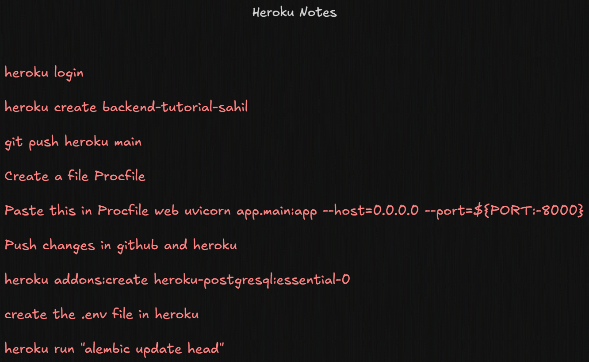

# 🚀 Learn Backend Course - Social Media API

A comprehensive FastAPI-based backend application demonstrating modern web development practices including RESTful API design, authentication, database management, CI/CD, and deployment.

---

# 🌐 Live API

Production URL:  
https://backend-tutorial-sahil-ab3c3398e7b9.herokuapp.com/

---

# 📋 Project Overview

This is a full-featured social media backend API built with FastAPI that includes:

- User authentication and authorization
- Post creation, management, and voting system
- Database migrations with Alembic
- Secure password hashing
- JWT-based authentication
- PostgreSQL database integration
- CORS support for frontend integration
- Automated CI/CD pipeline with GitHub Actions
- Heroku deployment workflow

---

# 🛠️ Technology Stack

## Core Framework
- FastAPI 0.135.1
- Uvicorn 0.41.0

## Database & ORM
- PostgreSQL
- SQLAlchemy 2.0.48
- Alembic 1.18.4
- psycopg2-binary 2.9.11

## Authentication & Security
- JWT Authentication
- python-jose 3.3.0
- passlib 1.7.4
- bcrypt 4.1.2

## Validation & Configuration
- Pydantic 2.12.5
- pydantic-settings 2.13.1
- python-dotenv 1.2.2

## Deployment & CI/CD
- Heroku
- GitHub Actions

---

# 📁 Project Structure

```bash
learn-backend-course/
│
├── app/
│   ├── routers/
│   │   ├── auth.py
│   │   ├── post.py
│   │   ├── user.py
│   │   └── vote.py
│   │
│   ├── config.py
│   ├── database.py
│   ├── models.py
│   ├── oauth2.py
│   ├── schemas.py
│   ├── utils.py
│   └── main.py
│
├── alembic/
├── .github/workflows/
├── .env
├── Procfile
├── requirements.txt
├── requirements-dev.txt
├── pyproject.toml
└── README.md
```

---

# 🚀 Heroku Deployment Guide

## 📸 Quick Heroku Notes



These are the exact commands and setup steps used for deploying this project to Heroku.

---

## 1️⃣ Login to Heroku

```bash
heroku login
```

## 2️⃣ Create Heroku App

```bash
heroku create backend-tutorial-sahil
```

## 3️⃣ Create Procfile

Create a file named:

```bash
Procfile
```

Add this:

```bash
web: uvicorn app.main:app --host=0.0.0.0 --port=${PORT:-8000}
```

## 4️⃣ Push Code to Heroku

```bash
git push heroku main
```

## 5️⃣ Add PostgreSQL Database

```bash
heroku addons:create heroku-postgresql:essential-0
```

## 6️⃣ Configure Environment Variables

```bash
heroku config:set DATABASE_hostname=...
heroku config:set DATABASE_port=...
heroku config:set DATABASE_name=...
heroku config:set DATABASE_user=...
heroku config:set DATABASE_password=...
heroku config:set secret_key=...
heroku config:set algorithm=HS256
```

## 7️⃣ Run Database Migration on Heroku

```bash
heroku run "alembic upgrade head"
```

## 8️⃣ Open Application

```bash
heroku open
```

---

# 🔄 Database Migrations

## Create Migration

```bash
alembic revision --autogenerate -m "message"
```

## Apply Migration

```bash
alembic upgrade head
```

## Downgrade Migration

```bash
alembic downgrade -1
```

---

# 🚀 CI/CD Pipeline

This project includes a complete CI/CD pipeline using GitHub Actions.

## Required GitHub Secrets

```env
HEROKU_API_KEY=your_api_key
HEROKU_APP_NAME=backend-tutorial-sahil-ab3c3398e7b9
HEROKU_EMAIL=your_email
```

## Get Heroku API Key

```bash
heroku login
heroku auth:token
```

---

# 🧪 Testing

You can test the API using:
- Swagger UI
- Postman
- curl
- httpx

---

# 🤝 Learning Concepts Covered

- REST API Design
- FastAPI Backend Development
- PostgreSQL Integration
- Authentication & Authorization
- Alembic Migrations
- CI/CD Pipelines
- Heroku Deployment
- Production-ready Backend Architecture

---

# 👨‍💻 Author

Sahil Mishra  
Backend Developer & Flutter Developer
